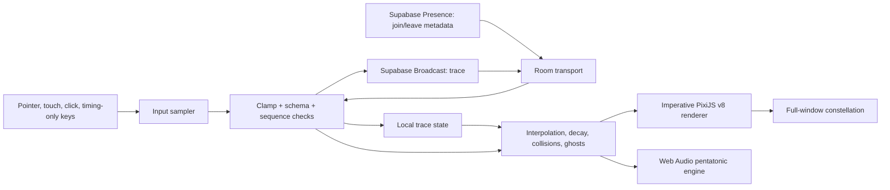

# Synchronicity

Synchronicity is a browser-based collaborative audiovisual sculpture for Hack the Arts. Visitors' movement rhythms become luminous traces; when independent traces intersect, the field answers with a starburst and a pentatonic tone.

> Art appears when our movements meet.

## Run locally

```powershell
npm.cmd install
Copy-Item .env.example .env.local
npm.cmd run dev
```

Open the Vite URL, press **Enter the field**, then move, tap, click, or press keys to shape the constellation.

## Environment

Realtime is opt-in and uses only browser-safe Supabase values:

```text
VITE_SUPABASE_URL=https://your-project.supabase.co
VITE_SUPABASE_PUBLISHABLE_KEY=sb_publishable_...
```

Leave them empty to run in deterministic local echo mode. The first release has no database tables, authentication, stored visitor data, camera, microphone, chat, or text capture. Never put a Supabase secret/service key in `.env`, Vercel, or the client bundle.

## Architecture



The shared room is `synchronicity:main`. High-frequency trace packets use Broadcast; Presence is reserved for slow-changing participant metadata. If Supabase is unavailable, bounded reconnect attempts end in a clearly labelled local echo mode with deterministic ghost performers.

## Scripts

```text
npm run dev       # Vite development server
npm run build     # TypeScript project build + production bundle
npm run lint      # ESLint
npm run test      # Vitest unit tests
npm run test:e2e  # Playwright Chrome checks
```

## Verification coverage

- malformed and out-of-range trace packets
- duplicate sequence rejection and input rate limiting
- pointer velocity/energy and timing-only rhythm quantization
- deterministic colors, interpolation, decay, collisions, and ghost replay
- reduced-motion particle budgets
- fake-channel Broadcast/Presence transport behavior
- audio initialization, mute, pitch mapping, and graceful failure
- keyboard reachability, responsive canvas mounting, and PNG capture download

## Attribution

Synchronicity uses React, TypeScript, Vite, PixiJS, Supabase Realtime, Vitest, and Playwright. Their names and logos remain the property of their respective owners. No external audio files or copyrighted visual assets are included; the sound is synthesized with the Web Audio API.

## Known limitations

- Realtime is ephemeral: refreshing or leaving the page removes a participant.
- A public Supabase project and publishable key are required for cross-browser live traces.
- WebGL/context failure falls back to the local experience; the renderer does not persist artwork.
- Browser autoplay policies require the visitor gesture used by **Enter the field** before sound can start.

